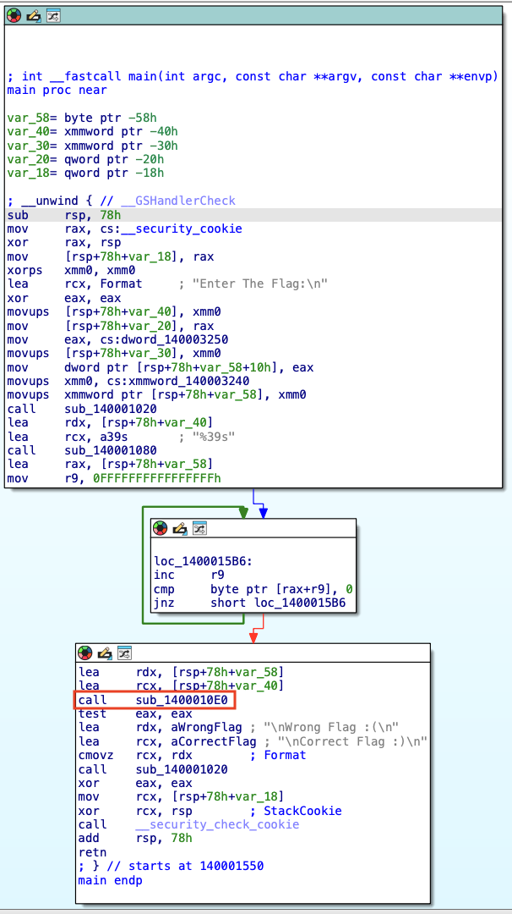
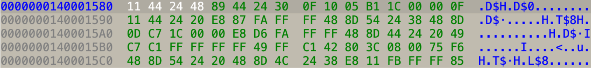
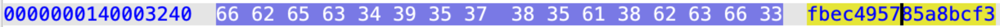

```
                        ▗▄▄▖ ▄▀▀▚▖█ █ 
                        ▐▌ ▐▌█  ▐▌█ █ 
                        ▐▛▀▚▖█  ▐▌█ █ 
                        ▐▌ ▐▌▀▄▄▞▘█ █ 
```

**Category:** Reversing
**Level:** Easy
> Just keep rolling.
>
> Hint: How many Anti-Analysis techniques do you know?

**Flag:** FlagY{93786fb0c07dddc2ca33f10aae2af7a6}

# WHAT EVEN IS THIS

`R0ll.exe` is a tiny 64-bit Windows binary that asks you to “Enter The Flag:” and prints either `Correct Flag :)` or `Wrong Flag :(`. Under the hood, `main` simply reads a 39-byte input and calls a function (`sub_1400010E0`) that does the real work.

That function:
- Builds a **39-byte target** from constants embedded in the binary (nine 32-bit integers, one 16-bit integer, one byte), stored little-endian.
- Loads a 19-byte **key table** from `.rdata` ("`fbec495785a8bcf346b`").
- Mutates the user input **in-place** in three blocks of 13 bytes using additions and XORs mixed with bytes from the key (indexed modulo 19).
- Compares the transformed input to the 39-byte target; only an exact match returns “success”.

In human terms: the program applies a deterministic, reversible rolling transformation to our 39-byte input and checks if the result equals a baked-in 39-byte target.

# WHY THIS IS A PROBLEM (TL;DR)

- The flag check is intentionally obfuscated (hand-rolled byte math, modular key indexing) but **not** cryptographically secure — it’s a reversible algorithm.
- Debugging the function directly is annoying because the binary includes anti-analysis noise and low-level indexing, which looks scary at first glance.
- Without extracting the **target bytes** and the **key table**, you can’t easily know what input will pass the check.
- But once you extract those two things, the transform is fully invertible — so the problem reduces to basic algebraic inversion (or writing a short script that undoes each step).

In one line: it looks like a maze, but the maze has no locks — just a single reversible mechanism. If you can read the constants, you can walk it backwards to the flag.

# SOLUTION

First things first, I checked what this file is, as well as checking the obvious with `file` and `strings`. From the `strings`, the only interesting things are these four lines.

```bash
> strings -n 10 R0ll.exe
...
fbec495785a8bcf346b
Enter The Flag:
Correct Flag :)
Wrong Flag :(
...
```

From there, I headed directly to IDA and checked out the main function. It seems that `main` prints `Enter The Flag:\n` and reads a string into a stack buffer (format `"%39s"`). It computes the input length with a small loop (the `inc r9 / cmp byte ptr [rax+r9],0` loop). It then calls `sub_1400010E0` with pointers to the input (likely *the verification routine*). Immediately after the call it does `test eax,eax` then uses `cmovz rcx, rdx` where: (1) `rdx` = pointer to `"Wrong Flag :(\n"`, (2) `rcx` = pointer to `"Correct Flag :)\n"`, (3) `cmovz rcx, rdx` means: if ZF==1 (i.e. `eax` was zero) then `rcx := rdx`. So, `sub_1400010E0` returns zero on WRONG and non-zero on CORRECT. Finally, it calls the print routine with `rcx`. That being said, we need to fully reverse `sub_1400010E0` and re-implement it to compute the expected flag.



I decompiled the `sub_1400010E0` and got the following code. The function initializes a 39-byte constant blob (`v58` + `v59` + `v60`), which are the *target* bytes the transformed input must equal. Then it runs a block-cipher-like in-place transform over the input buffer (13-byte rounds) that mixes input bytes with a second array (a key/table) pointed to by the *second* argument and uses the *fourth* argument as that table’s length (modulus). After the transform, it compares the transformed input bytewise to the 39-byte constant blob; if all equal it returns success. So to get the original user input, we have to invert that transform.

```C
__int64 __fastcall sub_1400010E0(__int64 a1, __int64 a2, __int64 a3, unsigned __int64 a4)
{
  char *v4; // rsi
  unsigned __int64 v6; // rdi
  char v7; // r9
  char v8; // r11
  __int64 v9; // rdi
  __int64 v10; // r15
  char v11; // bl
  char v12; // r10
  char v13; // r11
  char v14; // r10
  char v15; // r9
  char v16; // r8
  char v17; // bl
  char v18; // r10
  char v19; // r8
  char v20; // r11
  char v21; // r9
  char v22; // r8
  char v23; // bl
  unsigned __int64 v24; // rtt
  char v25; // r10
  char v26; // r8
  char v27; // r11
  unsigned __int64 v28; // rtt
  char v29; // r9
  char v30; // r8
  unsigned __int64 v31; // rtt
  char v32; // bl
  char v33; // r10
  char v34; // r8
  char v35; // r11
  unsigned __int64 v36; // rtt
  char v37; // r9
  char v38; // r8
  char v39; // bl
  unsigned __int64 v40; // rtt
  char v41; // r10
  char v42; // r8
  char v43; // r11
  unsigned __int64 v44; // rtt
  char v45; // r9
  char v46; // r8
  char v47; // bl
  unsigned __int64 v48; // rtt
  char v49; // r10
  unsigned __int64 v50; // rtt
  char v51; // r9
  char v52; // r10
  unsigned __int64 v53; // rtt
  char v54; // r11
  __int64 v55; // r9
  __int64 v56; // rcx
  _DWORD v58[9]; // [rsp+0h] [rbp-70h] BYREF
  __int16 v59; // [rsp+24h] [rbp-4Ch]
  char v60; // [rsp+26h] [rbp-4Ah]
  __int64 v61; // [rsp+28h] [rbp-48h]
  __int64 v62; // [rsp+30h] [rbp-40h]
  __int64 v63; // [rsp+38h] [rbp-38h]
  __int64 v64; // [rsp+40h] [rbp-30h]
  __int64 v65; // [rsp+48h] [rbp-28h]
  __int64 v66; // [rsp+50h] [rbp-20h]
  __int64 v67; // [rsp+58h] [rbp-18h]
  __int64 v68; // [rsp+60h] [rbp-10h]
  __int64 v69; // [rsp+68h] [rbp-8h]

  v58[0] = -907779687;
  v58[1] = 1342539355;
  v4 = (char *)(a1 + 1);
  v58[2] = -1943481129;
  v58[3] = -242202109;
  v61 = 3 - a1;
  v58[4] = -585186745;
  v58[5] = -1019284524;
  v62 = 4 - a1;
  v6 = a4 >> 1;
  v58[6] = 1366497130;
  v63 = 5 - a1;
  v58[7] = 1650496081;
  v58[8] = 1472276223;
  v64 = 6 - a1;
  v7 = 0;
  v59 = 11427;
  v60 = 25;
  v65 = 7 - a1;
  v8 = 0;
  v9 = v6 - a1;
  v66 = 8 - a1;
  v10 = ~a1;
  v67 = 9 - a1;
  v68 = 10 - a1;
  v69 = 11 - a1;
  do
  {
    v11 = *(v4 - 1);
    v12 = v8 + *(_BYTE *)((unsigned __int64)&v4[v10] % a4 + a2);
    v13 = *v4;
    v14 = v7 + v12;
    *(v4 - 1) = v7 + ((v11 + v14) ^ *(_BYTE *)((unsigned __int64)&v4[v9 - 1] % a4 + a2));
    v15 = v11 + v14 + *(_BYTE *)((unsigned __int64)&v4[-a1] % a4 + a2);
    v16 = v11 + ((v15 + v13) ^ *(_BYTE *)((unsigned __int64)&v4[v9] % a4 + a2));
    v17 = v4[1];
    *v4 = v16;
    v18 = v15 + v13 + *(_BYTE *)((unsigned __int64)&v4[1 - a1] % a4 + a2);
    v19 = v13 + ((v18 + v17) ^ *(_BYTE *)((unsigned __int64)&v4[v9 + 1] % a4 + a2));
    v20 = v4[2];
    v4[1] = v19;
    v21 = v18 + v17 + *(_BYTE *)((unsigned __int64)&v4[2 - a1] % a4 + a2);
    v22 = v17 + ((v21 + v20) ^ *(_BYTE *)((unsigned __int64)&v4[v9 + 2] % a4 + a2));
    v23 = v4[3];
    v24 = (unsigned __int64)&v4[v61];
    v4[2] = v22;
    v25 = v21 + v20 + *(_BYTE *)(v24 % a4 + a2);
    v26 = v20 + ((v25 + v23) ^ *(_BYTE *)((unsigned __int64)&v4[v9 + 3] % a4 + a2));
    v27 = v4[4];
    v28 = (unsigned __int64)&v4[v62];
    v4[3] = v26;
    v29 = v25 + v23 + *(_BYTE *)(v28 % a4 + a2);
    v30 = v23 + ((v29 + v27) ^ *(_BYTE *)((unsigned __int64)&v4[v9 + 4] % a4 + a2));
    v31 = (unsigned __int64)&v4[v63];
    v32 = v4[5];
    v4[4] = v30;
    v33 = v29 + v27 + *(_BYTE *)(v31 % a4 + a2);
    v34 = v27 + ((v33 + v32) ^ *(_BYTE *)((unsigned __int64)&v4[v9 + 5] % a4 + a2));
    v35 = v4[6];
    v36 = (unsigned __int64)&v4[v64];
    v4[5] = v34;
    v37 = v33 + v32 + *(_BYTE *)(v36 % a4 + a2);
    v38 = v32 + ((v37 + v35) ^ *(_BYTE *)((unsigned __int64)&v4[v9 + 6] % a4 + a2));
    v39 = v4[7];
    v40 = (unsigned __int64)&v4[v65];
    v4[6] = v38;
    v41 = v37 + v35 + *(_BYTE *)(v40 % a4 + a2);
    v42 = v35 + ((v41 + v39) ^ *(_BYTE *)((unsigned __int64)&v4[v9 + 7] % a4 + a2));
    v43 = v4[8];
    v44 = (unsigned __int64)&v4[v66];
    v4[7] = v42;
    v45 = v41 + v39 + *(_BYTE *)(v44 % a4 + a2);
    v46 = v39 + ((v45 + v43) ^ *(_BYTE *)((unsigned __int64)&v4[v9 + 8] % a4 + a2));
    v47 = v4[9];
    v48 = (unsigned __int64)&v4[v67];
    v4[8] = v46;
    v49 = v45 + v43 + *(_BYTE *)(v48 % a4 + a2);
    v50 = (unsigned __int64)&v4[v68];
    v4[9] = v43 + ((v49 + v47) ^ *(_BYTE *)((unsigned __int64)&v4[v9 + 9] % a4 + a2));
    v51 = v49 + v47 + *(_BYTE *)(v50 % a4 + a2);
    v52 = v4[10];
    v53 = (unsigned __int64)&v4[v69];
    v4[10] = v47 + ((v52 + v51) ^ *(_BYTE *)((unsigned __int64)&v4[v9 + 10] % a4 + a2));
    v54 = v51 + *(_BYTE *)(v53 % a4 + a2);
    v7 = v4[11];
    v8 = v52 + v54;
    v4[11] = v52 + ((v8 + v7) ^ *(_BYTE *)((unsigned __int64)&v4[v9 + 11] % a4 + a2));
    v4 += 13;
  }
  while ( (unsigned __int64)&v4[v10] < 0x27 );
  v55 = 0LL;
  v56 = a1 - (_QWORD)v58;
  while ( *((_BYTE *)v58 + v55 + v56) == *((_BYTE *)v58 + v55) )
  {
    if ( (unsigned __int64)++v55 >= 0x28 )
      return 1LL;
  }
  return 0LL;
}
```

If we recheck the `main`, we can see that before the `call sub_1400010E0`, there are two `lea` instructions immediately before it. One `lea` gives the first arg (input buffer) and the other gives the second arg (table), which is the **a2** we need.

Then, we follow the operand of that `lea` to the static data source IDA uses to populate the stack slot. The stack slot was earlier filled by movups from `cs:xmmword_140003240`. So, let's check out the hex.



When we decompiled `sub_1400010E0`, we saw it build a 39-byte array from three pieces in stack variables: (1) `v58[0..8]`—nine 32-bit integers (signed `dword`s), (2) `v59`—a 16-bit integer (`__int16`), and (3) `v60`—one byte (`char`). The function then compares the transformed user input to that 39-byte array. So our job is: *recreate the exact 39 bytes the binary expects from those numeric constants*.

There are two small but important details:
- **Byte ordering (little-endian):** On x86/x64, multi-byte integers are stored little-endian. That means when you convert the 32-bit integer `0xAABBCCDD` to bytes you get `DD CC BB AA` in the final buffer order.
- **Signed vs unsigned:** The disassembler prints some of the dwords as negative signed values (because they were stored as signed 32-bit ints). That’s fine — we just pack them as 32-bit little-endian words and Python will produce the correct bytes.

So, we take the nine 32-bit dwords in `v58`, then append `v59` as a 16-bit little-endian, then append `v60` as a single byte. That gives the **exact** 39 bytes used by `sub_1400010E0`.

```
9961e4c95b860550d7d4288c034a90f147c21eddd4f33ec36a17735151926062ff26c157a32c19
```

Now that we've found the target, we need to find the key.

Remember how we said that `sub_1400010E0` uses static data from `cs:xmmword_140003240`? Well, let's get the hex from `0x140003240`.



And would you look at that? Isn't that the string we got from the beginning?


From the decompiled code, `sub_1400010E0` transforms the 39-byte input in 3 blocks of 13 using a rolling table `a2` and modulus `a4`, then compares against a 39-byte target built from `v58[0..8]` (9 dwords), `v59` (0x2C93), `v60` (0x19) and turn them into target bytes:

```bash
99 61 e4 c9 5b 86 05 50 d7 d4 28 8c 03
4a 90 f1 47 c2 1e dd d4 f3 3e c3 6a 17
73 51 51 92 60 62 ff 26 c1 57 a3 2c 19
```

The table `a2` is the ASCII bytes at `.rdata:140003240`: `b"fbec495785a8bcf346b"` → `a4 = 19`.

So the function basically "rolls" input bytes around using that 19-byte key. Hence the name: `R0ll.exe`

The transform is reversible per block because each output depends only on the block’s original bytes and known key bytes. I algebraically inverted each assignment, carrying the small state between blocks.

```python
# r0ll_recover.py
import struct

dwords = [-907779687, 1342539355, -1943481129, -242202109, -585186745, -1019284524, 1366497130, 1650496081, 1472276223]
target = b''.join(struct.pack('<i', x) for x in dwords) + struct.pack('<H', 11427) + bytes([25])

key = b"fbec495785a8bcf346b"
a4 = len(key)

def invert_block(y, v7, v8, key: bytes, a4: int, v4_index: int):
    def k(ofs):
        return key[(v4_index + ofs) % a4]
    v12 = (v8 + key[(v4_index - 1) % a4]) & 0xff
    v14 = (v7 + v12) & 0xff
    x0 = ((( (y[0] - v7) & 0xff) ^ k(8)) - v14) & 0xff
    v15 = (x0 + v14 + k(0)) & 0xff
    x1 = ((( (y[1] - x0) & 0xff) ^ k(9)) - v15) & 0xff
    v18 = (v15 + x1 + k(1)) & 0xff
    x2 = ((( (y[2] - x1) & 0xff) ^ k(10)) - v18) & 0xff
    v21 = (v18 + x2 + k(2)) & 0xff
    x3 = ((( (y[3] - x2) & 0xff) ^ k(11)) - v21) & 0xff
    v25 = (v21 + x3 + k(3)) & 0xff
    x4 = ((( (y[4] - x3) & 0xff) ^ k(12)) - v25) & 0xff
    v29 = (v25 + x4 + k(4)) & 0xff
    x5 = ((( (y[5] - x4) & 0xff) ^ k(13)) - v29) & 0xff
    v33 = (v29 + x5 + k(5)) & 0xff
    x6 = ((( (y[6] - x5) & 0xff) ^ k(14)) - v33) & 0xff
    v37 = (v33 + x6 + k(6)) & 0xff
    x7 = ((( (y[7] - x6) & 0xff) ^ k(15)) - v37) & 0xff
    v41 = (v37 + x7 + k(7)) & 0xff
    x8 = ((( (y[8] - x7) & 0xff) ^ k(16)) - v41) & 0xff
    v45 = (v41 + x8 + k(8)) & 0xff
    x9 = ((( (y[9] - x8) & 0xff) ^ k(17)) - v45) & 0xff
    v49 = (v45 + x9 + k(9)) & 0xff
    x10 = ((((y[10] - x9) & 0xff) ^ k(18)) - v49) & 0xff
    v51 = (v49 + x10 + k(10)) & 0xff
    x11 = ((((y[11] - x10) & 0xff) ^ k(19 % a4)) - v51) & 0xff
    v54 = (v51 + k(11)) & 0xff
    t = (y[12] - x11) & 0xff
    u = t ^ k(20 % a4)
    x12 = (u - ((x11 + v54) & 0xff)) & 0xff
    next_v7 = x12
    next_v8 = (x11 + v54) & 0xff
    return [x0,x1,x2,x3,x4,x5,x6,x7,x8,x9,x10,x11,x12], next_v7, next_v8

def invert_all(target_bytes, key=key, a4=a4):
    v7=0
    v8=0
    res=[]
    for blk_idx in range(3):
        v4_index = 1 + 13*blk_idx
        y = list(target_bytes[13*blk_idx:13*(blk_idx+1)])
        xs, v7, v8 = invert_block(y, v7, v8, key, a4, v4_index)
        res.extend(xs)
    return bytes(res)

print(invert_all(target).decode(errors='ignore'))
```

Running this code (`r0ll_recover.py`) will decode the problem and print out the flag.


