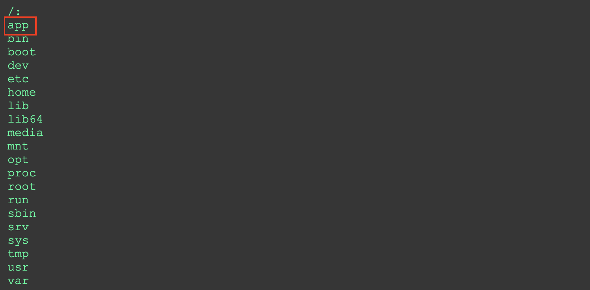
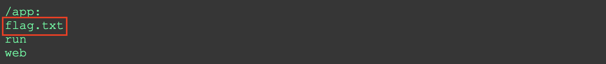
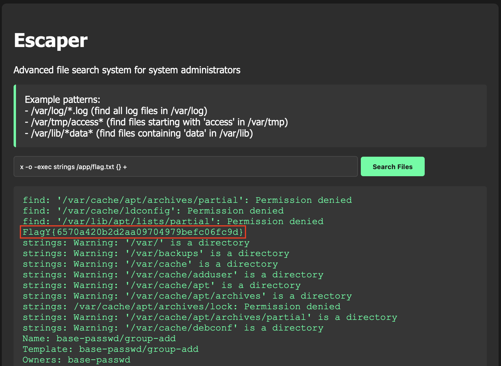

```
                ▗▄▄▄▖ ▄▄▄ ▗▞▀▘▗▞▀▜▌▄▄▄▄  ▗▞▀▚▖ ▄▄▄ 
                ▐▌   ▀▄▄  ▝▚▄▖▝▚▄▟▌█   █ ▐▛▀▀▘█    
                ▐▛▀▀▘▄▄▄▀          █▄▄▄▀ ▝▚▄▄▖█    
                ▐▙▄▄▖              █               
                                   ▀               
```

**Category:** Web
**Level:** Easy
**Instance:** http://bmnzdgnsz2l4.playat.flagyard.com
> I cannot escape my reality, can you escape it?

**Flag:** FlagY{6570a420b2d2aa09704979befc06fc9d}

# WHAT EVEN IS THIS

So the challenge greets us with a dramatic line: *“I cannot escape my reality, can you escape it?”*


...and then hands us a PHP page that *claims* to safely search files.

When we type something into a box, it goes through `escapeshellcmd()`, and PHP happily does:

```php
shell_exec("find /var/ -iname " . $safe_filename);
```

Basically, we're giving it input that ends up inside a find command.

The challenge name is already hinting that escaping is the whole game here—but who are we kidding, this smells like command injection disguised as a “file search.”

# WHY THIS IS A PROBLEM (TL;DR)

`escapeshellcmd()` isn’t our friend. It stops obvious bad stuff like `;`, `|`, and `&`, but leaves spaces and find options untouched. That means we can sneak in valid find syntax like:

```php
-o -exec <command> {} +
```

No special characters means no escape problems. And just like that, we’re running arbitrary commands right from a “search” box.

Congratulations, we’ve just weaponized `find`.


# SOLUTION

To understand this problem, let's check out the source code provided on the website.

```html
<?php
error_reporting(E_ALL);
ini_set('display_errors', 1);

$error = "";
$output = "";
$source = "";

if (isset($_GET['src'])) {
    $source = highlight_file(__FILE__, true);
}

if (isset($_POST['filename'])) {
    $filename = $_POST['filename'];
    
    if (strlen($filename) > 60) {
        $error = "Search pattern too long!";
    }
    else {
        $safe_filename = escapeshellcmd($filename);
        $output = shell_exec("find /var/ -iname " . $safe_filename . " 2>&1");
        
        if (empty($output)) {
            $output = "No files found matching your search pattern.";
        }
    }
}
?>

<!DOCTYPE html>
<html>
<head>
    <title>Escaper - File Search System</title>
    <style>
        body { 
            font-family: 'Segoe UI', Tahoma, Geneva, Verdana, sans-serif;
            background: #1a1a1a;
            color: #ffffff;
            margin: 0;
            padding: 20px;
        }
        .container { 
            margin: 20px auto;
            max-width: 800px;
            padding: 20px;
            background: #2d2d2d;
            border-radius: 8px;
            box-shadow: 0 4px 6px rgba(0,0,0,0.2);
        }
        .error { 
            color: #ff6b6b;
            padding: 10px;
            background: #2d2d2d;
            border-left: 4px solid #ff6b6b;
            margin: 10px 0;
        }
        .output { 
            background: #363636;
            padding: 15px;
            border-radius: 4px;
            font-family: 'Courier New', monospace;
            white-space: pre-wrap;
            color: #00ff9d;
        }
        .example {
            background: #363636;
            padding: 15px;
            border-radius: 4px;
            margin: 15px 0;
            border-left: 4px solid #00ff9d;
        }
        input[type="text"] {
            padding: 10px;
            width: 70%;
            background: #363636;
            border: 1px solid #4a4a4a;
            color: #ffffff;
            border-radius: 4px;
        }
        input[type="submit"] {
            padding: 10px 20px;
            background: #00ff9d;
            border: none;
            color: #1a1a1a;
            border-radius: 4px;
            cursor: pointer;
            font-weight: bold;
        }
        input[type="submit"]:hover {
            background: #00cc7e;
        }
        .source {
            position: fixed;
            top: 20px;
            right: 20px;
        }
        .source a {
            color: #00ff9d;
            text-decoration: none;
        }
        .source a:hover {
            text-decoration: underline;
        }
    </style>
</head>
<body>
    <div class="container">
        <h1>Escaper</h1>
        <p>Advanced file search system for system administrators</p>
        
        <div class="example">
            Example patterns:<br>
            - /var/log/*.log (find all log files in /var/log)<br>
            - /var/tmp/access* (find files starting with 'access' in /var/tmp)<br>
            - /var/lib/*data* (find files containing 'data' in /var/lib)
        </div>
        
        <form method="POST">
            <input type="text" name="filename" placeholder="Enter search pattern..." required>
            <input type="submit" value="Search Files">
        </form>

        <?php if ($error): ?>
            <p class="error"><?php echo htmlspecialchars($error); ?></p>
        <?php endif; ?>

        <?php if ($output): ?>
            <pre class="output"><?php echo htmlspecialchars($output); ?></pre>
        <?php endif; ?>
        
        <?php if ($source): ?>
            <div class="output"><?php echo $source; ?></div>
        <?php endif; ?>
    </div>
    
    <div class="source">
        <a href="?src">View Source</a>
    </div>
</body>
</html>
```

The most interesting and important part is: `shell_exec("find /var/ -iname " . $safe_filename . " 2>&1");`

We start small by poking around and see what we can see: `x -o -exec ls / {} +`. Boom, it lists the root directory. So much for isolation. But, if you actually look through it, you will discover that this command will traverse only for `var`. From the root directory list, `app` and `srv` seem interesting because these are common directories in CTF challenges.




Seeing that, let's keep calm and traverse `app` next: `x -o -exec ls /app {} +`. Aha — there’s a `flag.txt` sitting right there in `/app`.



And for the grand finale, I know your mind will definitely go to `cat`, but ***TRUST ME***, it will give you `cannot parse` error.


Instead, let's do: `x -o -exec strings /app/flag.txt {} +`. Out pops our shiny flag like it’s been waiting all along.




