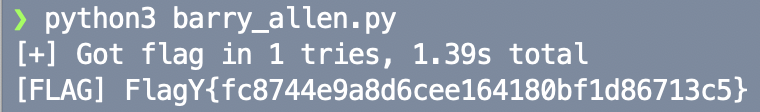

```
                        ▗▖   ▗▖  ▗▖ ▗▄▄▖
                        ▐▌   ▐▛▚▞▜▌▐▌   
                        ▐▌   ▐▌  ▐▌ ▝▀▚▖
                        ▐▙▄▄▖▐▌  ▐▌▗▄▄▞▘
```

**Category:** Web
**Level:** Easy
**Instance:** http://bmnzdgnsz2l4.playat.flagyard.com
> \- Who's the fastest man on Earth?
> = Whoooooooosh ( sound effect )

**Flag:** FlagY{f0879e26ead83c0faeab87d69e00e20d}

# WHAT EVEN IS THIS

A cute LMS with "Preview" buttons. Four courses live in `CourseController.php`; one of them (ID 2, "Advanced Security Concepts") secretly stores the flag in:

```php
'flag' => getenv('DYN_FLAG') ?: 'FlagY{test_flag}',
```

...but it's only echoed during a preview of section advanced if we've "legitimately" previewed the intro of both course 1 and course 2.

The site has:

- `index.php` — starts a preview via `?action=start_preview&course_id=...&section=...` then redirects to `preview.php`
- `preview.php` — calls `$courseController->showPreviewContent($courseId, $section)`
- `view.php` — gated by `$_SESSION['user_id']`

# WHY THIS IS A PROBLEM (TL;DR)

In a nutshell: Preview state is global and trust-happy.

`startPreview()` creates a single `$_SESSION['preview_state']` that all later preview requests reuse—regardless of course. Then:

- **Progress leakage:** `showPreviewContent()` happily mutates `$_SESSION['preview_state']['progress'][$courseId][]` for *whatever* course ID we put in the URL.
- **Cross-course condition:** the flag check explicitly requires us to have intro for course 1 *and* course 2, but it never enforces that those were earned under the same course's preview token.
- **Racey “timer”:** `expires` is set once at preview start using `time() + preview_length`. Course 1 gives us a whole 1 second ***(luxury!)***, course 4 is 0.8, course 2 is 0. The check is `if ($currentTime > $state['expires'])`, so equality still passes. In practice, starting with course 1 gives us ~1 second to chain the required requests.

Net effect: start one preview, then rapidly hit preview endpoints for different courses to mark progress and unlock the flag.

# SOLUTION

First, I checked out the instance and played around with it. The thing that strikes me most is how I couldn't access the other pages on that site but the *Preview Intro*. So, let's check out the challenge files they provided us.

Examining `CourseController.php`, we first discovered our target at the top of the code:

```php
'flag' => getenv('DYN_FLAG') ?: 'FlagY{test_flag}',
```

where it's located inside of course 2. If we read the information provided for this course id, we found out that it's a premium course with preview length 0 and it has several sections (intro, advanced, and practice).


So, let's see if we can take care of the problem. We then discovered that the app worked on a single shared preview bucket. The preview is created in `CourseController::startPreview()`. Furthermore, the token is never checked later. It just sits there looking pretty.

```php
$_SESSION['preview_state'] = [
    'course_id' => $courseId,
    'section' => $section,
    'started' => time(),
    'expires' => time() + ($course['preview_length'] > 0 ? $course['preview_length'] : 0),
    'token' => bin2hex(random_bytes(16)),
    'progress' => []
];
```


Let's continue on. Still looking at the same code, we discovered that progress write without auth/binding as shown in `showPreviewContent()`. No verification that this `courseId` matches the one used to start the preview.

```php
if ($section === 'intro') {
    if (!isset($_SESSION['preview_state']['progress'][$courseId])) {
        $_SESSION['preview_state']['progress'][$courseId] = [];
    }
    if (!in_array('intro', $_SESSION['preview_state']['progress'][$courseId])) {
        $_SESSION['preview_state']['progress'][$courseId][] = 'intro';
    }
}
```

Let's go even deeper. We discovered that the flag gate spans multiple courses as in `showPreviewContent()`. It only checks the presence of those progress marks. Here, we got our next clue to the target: we need to access course 2's advanced section.

```php
if (isset($course['flag']) && 
    isset($state['progress'][1]) && in_array('intro', $state['progress'][1]) &&
    isset($state['progress'][2]) && in_array('intro', $state['progress'][2]) &&
    $section === 'advanced') {
    echo "Flag: {$course['flag']}\n";
}
```

Let's dive to the bottom. The last nail on the coffin: we found the timer that's (barely) a timer. With `course 1`'s `preview_length = 1`, we got a workable race window. Even more, the `preview_length` got smaller and smaller.

```php
$currentTime = time();
...
if ($currentTime > $state['expires']) {
    unset($_SESSION['preview_state']);
    echo "Preview has expired\n";
    return;
}
```

*"So, what is our plan?" you asked.*

First, we need to create a preview session with the longest window. In our case, it's course 1 (`preview_length = 1`). So, we need to visit `/index.php?action=start_preview&course_id=1&section=intro`. We land on `preview.php?course_id=1&section=intro`, and `showPreviewContent()` records `$_SESSION['preview_state']['progress'][1][] = 'intro';`.

Then, we piggyback progress for course 2 without restarting preview. This means that we need to visit `/preview.php?course_id=2&section=intro` within ~1 second. `showPreviewContent()` doesn’t validate that this matches the course we started with. Because `section === 'intro'`, it adds `$_SESSION['preview_state']['progress'][2][] = 'intro';`.

Finally, we cash out by requesting the guarded section `/preview.php?course_id=2&section=advanced`. Inside `showPreviewContent()`, it prints title and content. Then this condition fires the echoing of the flag. Since we've satisfied everything, so the flag is printed.

Theoretically speaking, of course. But the fact is, we can't do that manually. So, I crafted a Python code to automate the process *(See barry_allen.py)*.




The challenge description asked, "Who's the fastest man on Earth?" Let me tell you who.

