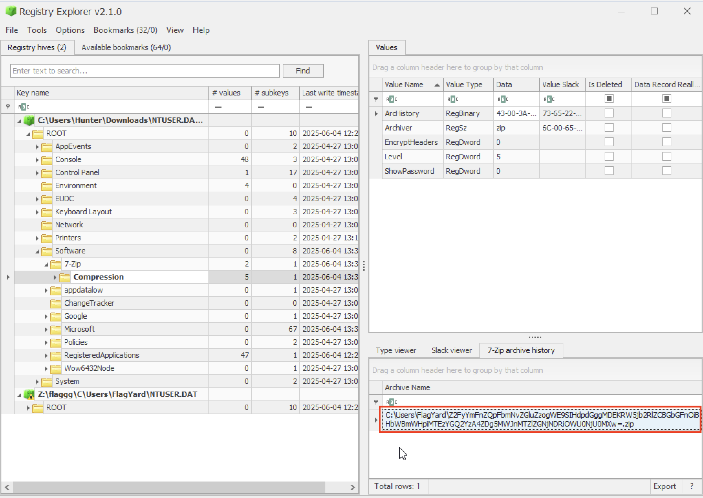

```
           ▗▄▄▖▄▄▄  ▄▄▄▄  ▄▄▄▄   ▄▄▄ ▗▞▀▚▖ ▄▄▄  ▄▄▄ ▗▞▀▚▖   ▐▌     ▗▄▄▖▄▄▄  ▄▄▄▄  ▗▞▀▀▘▗▞▀▚▖ ▄▄▄  ▄▄▄ ▄  ▄▄▄  ▄▄▄▄  
          ▐▌  █   █ █ █ █ █   █ █    ▐▛▀▀▘▀▄▄  ▀▄▄  ▐▛▀▀▘   ▐▌    ▐▌  █   █ █   █ ▐▌   ▐▛▀▀▘▀▄▄  ▀▄▄  ▄ █   █ █   █ 
          ▐▌  ▀▄▄▄▀ █   █ █▄▄▄▀ █    ▝▚▄▄▖▄▄▄▀ ▄▄▄▀ ▝▚▄▄▖▗▞▀▜▌    ▐▌  ▀▄▄▄▀ █   █ ▐▛▀▘ ▝▚▄▄▖▄▄▄▀ ▄▄▄▀ █ ▀▄▄▄▀ █   █ 
          ▝▚▄▄▖           █                              ▝▚▄▟▌    ▝▚▄▄▖           ▐▌                  █             
                          ▀                                                                                         
```

**Category:** Forensics
**Level:** Easy
> You are provided with a forensic triage image containing only the user-level registry hives NTUSER.DAT and UsrClass.dat. Your objective is to identify the archive file that the intruder created for staging exfiltration data, and obtain the hidden flag.

**Flag:** FlagY{c002ae7b19e980cf07debb55c8d57450}

# SOLUTION

Given the files, I looked around in the internet on the best tool to look through them. That's when I stumbled upon the godsend Registry Explorer. So, I went ahead and opened the `NTUSER.dat` there. This is where my nasty habit of skipping alerts bit me in the ass. I spent hours on what should have been a split second had only I read the alerts telling me to clean the dirty hive by inserting the logs, i.e., `ntuser.dat.LOG1` and `ntuser.dat.LOG2`.

So, after cleaning the hive and loading the cleaned version into the Registry Explorer, we tried to find our **compressed** folder. Specifically, under `ROOT > Software > 7-Zip`.



There, I found something interesting on the archive history and tried to decode it. However, it came out gibberish. But, it gave us a crucial hint: it's been encoded by XOR with 01.

```bash
❯ echo "Z2FyYmFnZQpFbmNvZGluZzogWE9SIHdpdGggMDEKRW5jb2RlZCBGbGFnOiBHbWBmWHpiMTEzYGQ2YzA4ZDg5MWJnMTZlZGNjNDRiOWU0NjU0MXw=" | base64 -d
garbage
Encoding: XOR with 01
Encoded Flag: Gm`fXzb113`d6c08d891bg16edcc44b9e46541|
```

So, let's do it and be done with it.

```bash
❯ echo "Z2FyYmFnZQpFbmNvZGluZzogWE9SIHdpdGggMDEKRW5jb2RlZCBGbGFnOiBHbWBmWHpiMTEzYGQ2YzA4ZDg5MWJnMTZlZGNjNDRiOWU0NjU0MXw=" | base64 -d \
  | python3 -c 'import sys
d=sys.stdin.buffer.read()
h1,h2,body = d.split(b"\n",2)
sys.stdout.buffer.write(h1 + b"\n" + h2 + b"\n" + bytes(b ^ 0x01 for b in body))'
garbage
Encoding: XOR with 01
Dobnede!Gm`f;!FlagY{c002ae7b19e980cf07debb55c8d57450}
```

