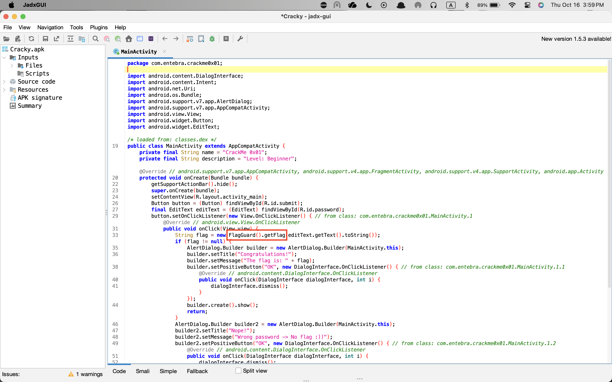
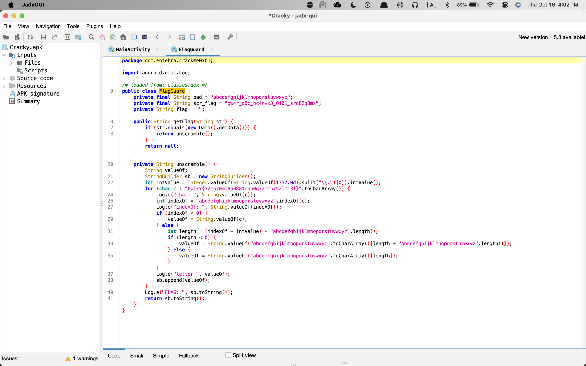

```
           ▗▄▄▖▄▄▄ ▗▞▀▜▌▗▞▀▘█  ▄ ▄   ▄ 
          ▐▌  █    ▝▚▄▟▌▝▚▄▖█▄▀  █   █ 
          ▐▌  █             █ ▀▄  ▀▀▀█ 
          ▝▚▄▄▖             █  █ ▄   █ 
                                  ▀▀▀  
```

**Category:** Forensics
**Level:** Hard
> High-profile tech company has released an Android application as part of their new security system. However, the application appears to have been compromised, and sensitive information may be hidden within its code. Your task is to reverse engineer the application, uncover the hidden logic, and retrieve the flag that proves the application has been tampered with. The challenge involves decompiling the APK, analyzing the source code, and identifying the correct password to unscramble the hidden flag.

**Flag:** FlagY{72bd70ba8e0881dce0f72bb5752ab13a}

# SOLUTION

Given an `.apk` file, I opened it in `jadx-gui` to observe how it worked. Once there, I directly aimed for the heart, i.e., the `MainActivity`.



Well, look at that. `FlagGuard()` seems intriguing. So, let's put another stake to that.



Well people, we just hit the jackpot. So, our next order of business is to reverse the `unscramble()` logic and recover the flag. `unscramble()` shifts lowercase letters by `-1337 mod 26`. `1337 % 26 = 11` means effectively each lowercase letter is shifted left by 11. As such, `new_index = (index - 11) mod 26`. Note that non-lowercase characters are left unchanged. Then, we need to applying that transformation to the hard-coded string `FwlrY{72mo70ml8p0881onp0q72mm5752lm13l}` to get the flag.

*(See solve.py)*

