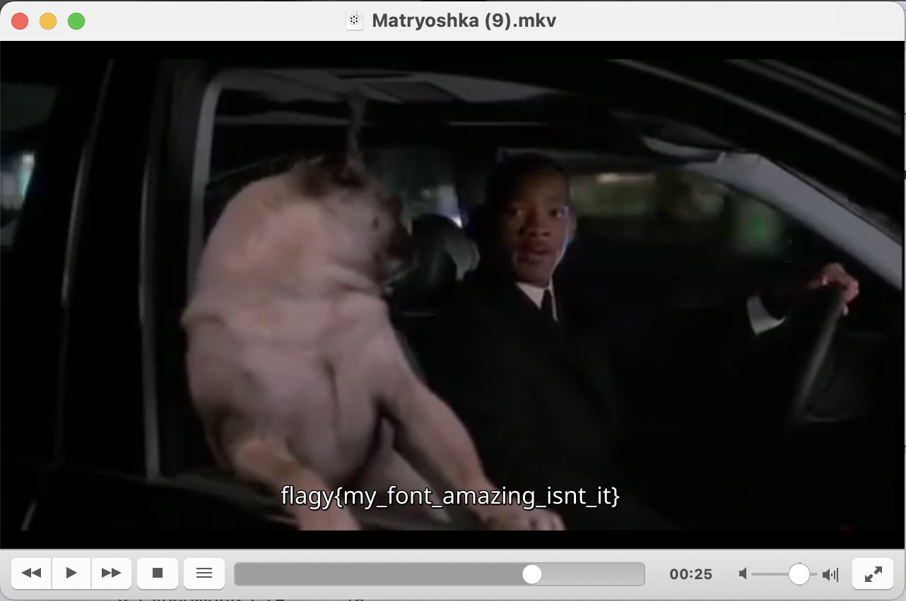

```
                    ▗▖  ▗▖▗▞▀▜▌   ■   ▄▄▄ ▄   ▄  ▄▄▄   ▄▄▄ ▐▌   █  ▄ ▗▞▀▜▌
                    ▐▛▚▞▜▌▝▚▄▟▌▗▄▟▙▄▖█    █   █ █   █ ▀▄▄  ▐▌   █▄▀  ▝▚▄▟▌
                    ▐▌  ▐▌       ▐▌  █     ▀▀▀█ ▀▄▄▄▀ ▄▄▄▀ ▐▛▀▚▖█ ▀▄      
                    ▐▌  ▐▌       ▐▌       ▄   █            ▐▌ ▐▌█  █      
                                 ▐▌        ▀▀▀                            
```

**Category:** Forensics
**Level:** Medium
> I am an old game; made of wood and stacked you need to learn some languages to understand me.
> 
> Flag format: FlagY{}

**Flag:** FlagY{my_font_amazing_isnt_it}

# SOLUTION

We are given a folder of 13 `.mkv` files. The next logical step to me was to inspect whether there are any hidden layers. Turns out, the only interesting layers were the text layers in `(3)`, `8`, and `9`.

```bash
❯ mediainfo -i *
Complete name                            : Matryoshka (1).mkv
...
Complete name                            : Matryoshka (10).mkv
...
Complete name                            : Matryoshka (11).mkv
...
Complete name                            : Matryoshka (12).mkv
...
Complete name                            : Matryoshka (13).mkv
...
Complete name                            : Matryoshka (2).mkv
...
Complete name                            : Matryoshka (3).mkv
...
Text
ID                                       : 2
Format                                   : UTF-8
Codec ID                                 : S_TEXT/UTF8
Codec ID/Info                            : UTF-8 Plain Text
Default                                  : Yes
Forced                                   : No
...
Complete name                            : Matryoshka (4).mkv
...
Complete name                            : Matryoshka (5).mkv
...
Complete name                            : Matryoshka (6).mkv
...
Complete name                            : Matryoshka (7).mkv
...
Complete name                            : Matryoshka (8).mkv
...
Text #1
ID                                       : 4
Format                                   : S_TEXT/ASCII
Codec ID                                 : S_TEXT/ASCII
Language                                 : English
Default                                  : Yes
Forced                                   : No

Text #2
ID                                       : 5
Format                                   : S_TEXT/ASCII
Codec ID                                 : S_TEXT/ASCII
Language                                 : English
Default                                  : Yes
Forced                                   : No
...
Complete name                            : Matryoshka (9).mkv
...
Text
ID                                       : 3
Format                                   : S_TEXT/WEBVTT
Codec ID                                 : S_TEXT/WEBVTT
Duration                                 : 33 s 500 ms
Bit rate                                 : 97 b/s
Frame rate                               : 0.358 FPS
Count of elements                        : 12
Stream size                              : 410 Bytes (0%)
Default                                  : Yes
Forced                                   : No
```

So, I extracted the text layers using `mkvextract <input> tracks #:./track_#.txt` and checked them out. Texts from `(3)` and `(8)` seemed ordinary enough. Well... so was `(9)`, except for the one Chinese line.

```
WEBVTT

1
00:00:00.500 --> 00:00:04.000
Aprendi a me virar e você voltou

2
00:00:04.100 --> 00:00:06.000
do espaço sideral

3
00:00:06.100 --> 00:00:10.500
e agora vejo que você está aqui no baixo astral

4
00:00:10.600 --> 00:00:14.000
eu devia me mudar e ter tomado a sua chave

5
00:00:14.100 --> 00:00:17.500
se soubesse que ia voltar para mim enfernizar

6
00:00:17.600 --> 00:00:19.500
agora vai, sai daqui

7
00:00:19.600 --> 00:00:21.500
Frank!

8
00:00:21.600 --> 00:00:24.100
ponha a cabeça para dentro

9
00:00:24.200 --> 00:00:26.500
籿段籺粀粒粔粆粒理籿粈粇粍理籺粆籺粓粂粇粀理粂粌粇粍籸粂粍粖

10
00:00:26.600 --> 00:00:29.500
tá legal

11
00:00:29.600 --> 00:00:33.500
hhmm... hhmmm... hmmm...

12
00:00:33.600 --> 00:00:34.000
FRANK!!!
```

As a Chinese-speaking person, that line made no sense to me. The other lines seemed to connect to each other because I tried to translate them. On a hunch, I tried to translate line 9 too, just in case. And I was right. The translator just returned the same string back to me. Maybe... it's a font?

Following on that hunch, I opened the `.mkv` file on VLC and found the flag.




