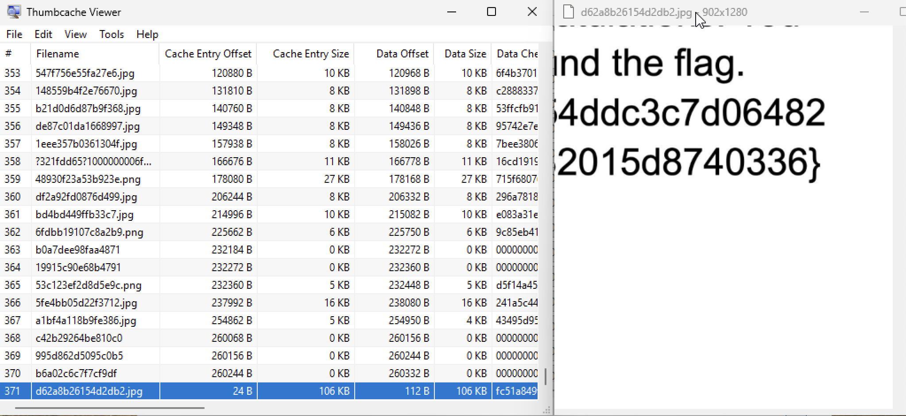
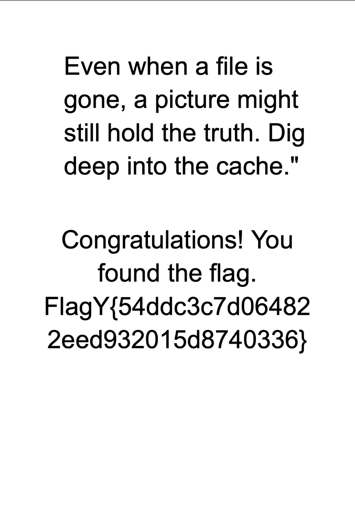

```
          ▗▄▄▖ ▐▌▗▞▀▜▌▄▄▄▄     ■   ▄▄▄  ▄▄▄▄  
          ▐▌ ▐▌▐▌▝▚▄▟▌█   █ ▗▄▟▙▄▖█   █ █ █ █ 
          ▐▛▀▘ ▐▛▀▚▖  █   █   ▐▌  ▀▄▄▄▀ █   █ 
          ▐▌   ▐▌ ▐▌          ▐▌              
                              ▐▌              
```

**Category:** Forensics
**Level:** Easy
> A suspicious image file was deleted from a user's system, but remnants of it may still exist within the Windows cache. Your task is to recover this deleted image and uncover the hidden flag.

**Flag:** FlagY{54ddc3c7d064822eed932015d8740336}

# SOLUTION

First things first, let's take a look at the challenge file. Since the challenge description hinted at Windows cache, we should focus on `iconcache_*.db` and `thumbcache_*.db`, which are located in `Local/Microsoft/Windows/Explorer/`. To access them, I used [Thumbcache Viewer](https://thumbcacheviewer.github.io).

Honestly, this is a straightforward challenge. But I had to spend quite some time installing Windows because I was so stubborn on using MacOS and Kali.

Anyway... Inserting them into the viewer, we soon found the image in `thumbcache_1280.db`.



So, I went ahead and downloaded the image because for some reason the viewer window cropped the image. And ***Voila!***



